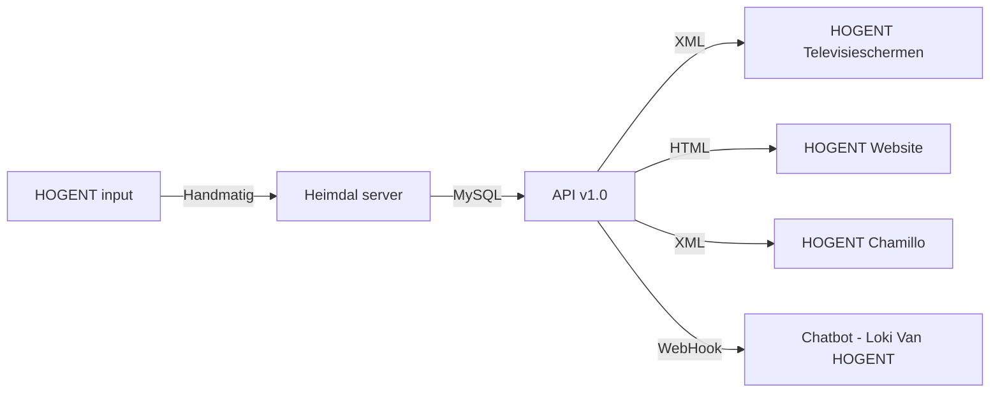

# Welkom bij #Resto1.0

Hi! Deze github repository geeft je een beter inzicht van hoe onze API werkt voor de **HOGENT** resto's. Als je meer wilt leren over onze API's kan je onze website bezoeken [HEIMDAL.be](https://heimdal.be/).

## Sleutel aanvragen

>Enkel toegankelijk voor HOGENT-studenten, partners en sponsers

Stuur een mail naar gate@heimdal.be met een motivatie.

## Hoe werkt het?

## Bijdragers aan LokiOS
Heimdal is een studentenvereniging opgebouwd uit eigen initiatief door een groep studenten. Studenten die graag andere mensen, die geassocieerd zijn met de Hogeschool Gent en geïnteresseerd zijn in Geeky Stuff, samen wilt brengen.
- Thomas Schuddinck (Coördinator)
 - [Hans De Boeck](https://hansdeboeck.be/)  (Hoofd-developper)
 - Stephen Nijsten (Developer)
 - Stef Bondroit (Developer)
